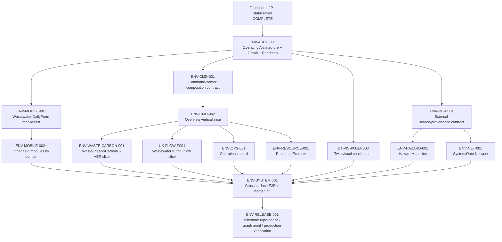

# UTH[AI]-ENV — Unified Roadmap

Last updated: 2026-08-28
Status: PROJECT ROADMAP SSoT

## Goal

Evolve the existing production app into the user-confirmed Hospital Environmental Intelligence Platform without discarding working operational workflows, the Digital Twin foundation, data-honesty rules, security/privacy boundaries, or mobile field usability.

This roadmap is sequential authority for planning, not permission to edit every lane in parallel. Each production milestone is executed through bounded work orders in `CURRENT-WORK.md` under `ENV-ENGINEERING-LOOP.md`.

## Authorization note — 2026-08-27

The user explicitly authorized continued ENV development toward the project goal. Earlier deferred lanes may now be **planned and activated one bounded slice at a time** when their dependencies and ownership gates are satisfied. This does not authorize overlapping writers, speculative scope expansion, bypassing review, or collapsing multiple milestones into a mega-PR.

## Milestone map

## Completed foundation

### Foundation and stabilization — COMPLETE

Merged work already provides:

- Supabase-first production architecture;
- Auth/RLS and pending-user controls;
- working wastewater CRUD/history/reporting/dashboard;
- Digital Twin foundation and first site-authentic visual slice;
- analytics kit;
- responsive header/navigation scale remediation;
- PHI/provider safe-boundary remediation;
- alert unread idempotency remediation;
- exact-branch Playwright CI behavior;
- goal-first engineering loop, defect memory and prototype north star.

Do not reopen completed WOs without new evidence.

## M0 — Project operating architecture

### ENV-ARCH-001 — Operating Architecture + Graph + Roadmap

**State:** COMPLETE — merged via PR #39 as `08db62c821cf7b95aaeb373c603d77ccc4d9b98a`.

Goal:

- provide one resumable project operating index;
- map current runtime/system architecture;
- map dependencies, ownership, risks, evidence and lineage;
- record current-state route/form/dashboard inventory;
- create unified roadmap and critical path.

Deliverables:

- `PROJECT-OPERATING-MAP.md`;
- `architecture/SYSTEM-ARCHITECTURE.md`;
- `graph/PROJECT-GRAPH.md`;
- this `ROADMAP.md`;
- `research/CURRENT-STATE-INVENTORY-2026-08-27.md`;
- updated AGENTS/CURRENT-WORK/HANDOFF references.

No production source changes in this WO.

## M1 — Mobile-first operational recording

### ENV-MOBILE-001 — Wastewater DailyForm mobile-first completion

**State:** COMPLETE — PR #40 merged as `74675a532a871c7bba78de15eccb35b6b0ba433b`; post-merge test/E2E/Pages deployment and live auth-gated production smoke passed.

**Priority:** P0 product-experience slice after ENV-ARCH-001.

Why first:

- daily wastewater recording is the densest observed operational flow;
- field users primarily use phones;
- source shows multiple unconditional two-column grids at phone widths;
- correctness/hydration semantics are already strong, so layout/interaction can improve without redesigning the data model.

Bounded objective:

- make full DailyForm completion practical at 360–430 px;
- preserve all current form/data semantics;
- stack or selectively group numeric fields by mobile priority;
- preserve sticky actions without obscuring content;
- prove no horizontal overflow;
- add real-user phone E2E for input, validation, save/error interaction and edit-hydration protection.

Likely owner split:

- GPT: responsive/UX contract + review;
- Visual implementation owner: responsive layout/interaction;
- Core Engineering only if test/data semantics require it.

### ENV-MOBILE-002+ — Domain form convergence

**Completed bounded slice:** `ENV-MOBILE-002` — Chemical form. PR #42 reviewed exact head `795aefcf86442029923be87110831e08c589ad8d`, merged as `f26c753a6e49a65dfc9e5d43a482380f79dece0c`, post-merge test/E2E/Pages green, deployment `6136344674` successful, and live mobile production smoke passed. Contract: `docs/work-orders/ENV-MOBILE-002-CHEMICAL.md`.

**Completed bounded slice:** `ENV-MOBILE-003` — Water Supply. PR #44 reviewed exact head `5cd8f4aa304812868a669bab614177f8a4525c1b`, merged as `d3034d83954ec8287b9dab561f7802668207d23e`, post-merge test/E2E/Pages green, deployment `6137172294` successful, and live 390px deployed-bundle smoke passed without real writes. Contract: `docs/work-orders/ENV-MOBILE-003-WATER-SUPPLY.md`.

**Completed bounded slice:** `ENV-MOBILE-004` - Fuel. PR #46 reviewed exact head `8e871d225a67f1da2a1c143556c2b34aaf9e90c6`, merged as `57f0bb3dd5c9a7e74ee0deb84bb166b215a8706a`; post-merge test/E2E/Pages are green, deployment `6142569782` succeeded for the exact merge SHA, and live 390px root-to-client deployed-bundle smoke passed with mocked REST/no real writes. Contract: `docs/work-orders/ENV-MOBILE-004-FUEL.md`.

**Completed bounded slice:** `ENV-MOBILE-005` - Garden. Fresh review APPROVED exact head `327ae8b541f3e29f5727acc7edb3ed76b12f20bc`; PR #48 merged as `001ef532b1203b3bd2def7c28bdd6845a948dec8`; exact merge-SHA test/E2E/Pages are green; deployment `6150037544` succeeded; live 390px root-to-client deployed-bundle smoke passed with mocked REST/no real writes. Garden data/schema/carbon/shared-shell semantics remain unchanged.

**Completed bounded slice:** `ENV-MOBILE-006` — Garbage. External GLM-5.3 MAX APPROVED exact head `e723d07359ebd8c1ddb7fed772c083ee1b0e32db`; PR #63 merged as `c975291c59e9c462120948af60c7ae04d5b2fbeb`; exact-main test/E2E/Pages and deployment `6199171927` succeeded. Live root-to-client 360/390px deployed-bundle probes passed with mocked REST/no real writes, 9/9 labels, >=44px Save/Delete, and no settled document overflow. Direct Pages deep-link retains the known shared ModuleDock/404-to-SPA settling observation and is not a Garbage-page regression. Contract: `docs/work-orders/ENV-MOBILE-006-GARBAGE.md`.

**Completed bounded slice:** `ENV-MOBILE-007` — Safety. External GLM-5.3 MAX independently APPROVED exact head `a81f4c1d6090b79094f7f07bebfc65dca1b36b3f`; PR #65 merged as `2194411c4cc2e63eefc89218328d34116a2b7b81`. Exact-main test/E2E/Pages succeeded, including full Playwright 115/115, and live deployed root-to-client 390px smoke passed with mocked REST/no real writes, 7/7 label associations, 48px Save and no settled document overflow. Safety Core/import/schema/RLS/alert/date/count/boolean/shared-shell semantics remained unchanged. Contract: `docs/work-orders/ENV-MOBILE-007-SAFETY.md`.

**Closed Core prerequisite:** `FOOD-CORE-001`. GLM-5.3 MAX implemented and GPT-5.6 Sol independently APPROVED exact head `459890276f0b7dece784755665448f5f0222fbb6`; PR #66 merged as `09f2603308255879e2989ae25c985b7b75ddd118`. Exact-main test/E2E/Pages succeeded (E2E 115/115). Production migration applied 4/4 OK after a zero-row/zero-invalid preflight; both Food categorical CHECKs are live/validated, reagent trigger definition is unchanged, and no environmental rows were mutated. Reagent stock decrement remains dormant pending separate hardening.

**Completed bounded slice:** `ENV-MOBILE-008` — Food. Fresh exact-SHA review APPROVED PR #68 head `d894c58611ba455f813d4e8c5698098ebc64f5c4`; expected-head merge produced `73f76cd42636be0253c0a2e4a9c906d8fe164582`. Exact-main test/E2E/Pages succeeded, including a clean **124/124** full Playwright run. Live deployed root→client probes at 360/390/430 passed with mocked REST/no real writes and document/body width equal to viewport. Direct Pages `/food` deep-link retains the known hosting/shell-path geometry signal and is tracked separately from Food content. `FOOD-CORE-001` remains CLOSED/LIVE VERIFIED; Food Core/import/schema/RLS/reagent-trigger/shared UI were unchanged. Building remains `DECISION_REQUIRED` until the `repair_needed` → `core.repair_request` contract is settled.

After Mobile-001 provides a proven pattern, audit and improve one domain per WO, prioritized by field frequency and control density:

1. Chemical;
2. Water Supply;
3. Fuel;
4. Garden / Garbage;
5. Food / Safety / Building.

Do not create one giant all-forms PR.

## M2 — Shared command-center composition

### ENV-CMD-001 — Responsive command-center composition contract

Goal:

- define reusable page/panel hierarchy for desktop/tablet/mobile using existing Aura/analytics/Twin foundations;
- define KPI/situation/provenance/alert/panel states;
- define drill-down and cross-surface behavior;
- avoid a broad navigation rewrite.

Output is a bounded design/component contract before production composition changes.

### ENV-CMD-002 — Hospital Overview command-center vertical slice

Upgrade the existing overview incrementally toward the prototype north star:

- environmental situation summary;
- decision-relevant freshness/source;
- links into wastewater/Twin, carbon, waste, hazards and operations;
- mobile recomposition rather than desktop shrink;
- use truthful current data only; unavailable modules remain explicit.

## M3 — Signature environmental intelligence slices

### ENV-WASTE-CARBON-001 — Waste / Plastics / Carbon / T-VER

Dependency: inventory actual waste/plastic/carbon/T-VER contracts first.

Target: prototype-inspired integrated view for waste categories, emissions and evidence readiness, but never invent T-VER eligibility/status or carbon factors.

### UX-FLOW-P001 — Wastewater environmental flow

Inventory comparable quantities/units first; Sankey width encodes quantity only where period/unit semantics are valid. Missing quantities remain missing.

### ENV-OPS-001 — Operations board

Inventory incidents, repair requests, inspections, thresholds, responsible party and evidence contracts before UI implementation.

## M4 — Digital Twin continuation

### DT-VIS-P002 / P003

Continue existing approved Digital Twin direction without replacing it with a 2D dashboard.

Dependencies/guardrails remain in `docs/ai/digital-twin/03-MICRO-STEP-BOARD.md` and process-knowledge SSoT.

Twin work may run parallel to independent non-overlapping slices only after ownership graph review.

## M5 — External Environmental Intelligence

### ENV-INT-P001 — Source + provenance contract

Before map production work:

- inventory actual GISTDA entitlement/endpoints;
- research current TMD and ThaiWater/HII source options as applicable;
- define normalized observation/forecast/model/source contract;
- keep provider keys out of browser/Git/chat;
- preserve valid time, ingestion time, freshness, units and location.

### ENV-HAZARD-001 — Hazard Map vertical slice

Only after ENV-INT-P001.

Initial bounded map can start with the best-supported source family rather than pretending all PM2.5/heat/river/flood layers are production-ready simultaneously.

## M6 — Advanced relationship surfaces

### ENV-RESOURCE-001 — Resource Explorer

Hierarchical contribution view after breakdown data is reliable.

### ENV-NET-001 — System/Data Network

Dependency/lineage view after identifiers and source relationships are stable. It should expose interpretable relationships, not decorative graph complexity.

## M7 — Cross-surface integration and hardening

### ENV-SYSTEM-001

Goal: behave as one product rather than independent pages.

Test and harden:

- deep links between alert/operation → Twin/domain detail;
- KPI/trend → analytics/history;
- hazard status → map layer;
- flow/resource nodes → source/history;
- mobile field flows;
- auth/session/RLS states;
- stale/unknown/error/retry semantics;
- touch/keyboard/reduced-motion accessibility;
- failure recovery;
- performance/bundle/rendering budgets;
- security/PHI boundaries.

Run full real-user E2E and targeted deep-bug scenarios.

## M8 — Project completion audit / release checkpoint

### ENV-RELEASE-001

Create a fresh milestone audit branch from then-current `origin/main`, not the historical repo-health branch.

Completion audit must verify:

- all active roadmap WOs closed or explicitly deferred by user decision;
- SSoT/graph/architecture consistency;
- no stale ownership/branch claims;
- full applicable unit/integration/E2E gates;
- production deploy/smoke;
- security/privacy/data-honesty review;
- responsive/accessibility evidence;
- dependency/package/CI health;
- defect-memory regression coverage;
- prototype goal coverage without fabricated data semantics.

Only after this audit may the current major product milestone be called complete.

## Critical-path rule

The next eligible bounded slice is the first incomplete item whose dependencies are satisfied. Do not ask the user what to do next when this roadmap + CURRENT-WORK already provides an authorized next step, unless a product choice, irreversible trade-off, secret/access need, or ownership conflict requires user input.

## Definition of project “finished” for this roadmap

“Finished” does not mean every imaginable environmental feature exists. It means the current user-confirmed product goal is delivered to an auditable milestone:

- mobile operational recording works safely and responsively;
- command-center/dashboard experience substantially matches the confirmed north-star hierarchy;
- Digital Twin remains integrated and truthful;
- selected waste/carbon/flow/operations/hazard/resource/network surfaces are implemented only where data contracts support them;
- cross-surface workflow works as one product;
- all critical security/data-honesty/accessibility/reliability gates pass;
- production deployment is verified;
- remaining ideas are explicitly backlog/deferred rather than hidden incomplete work.
