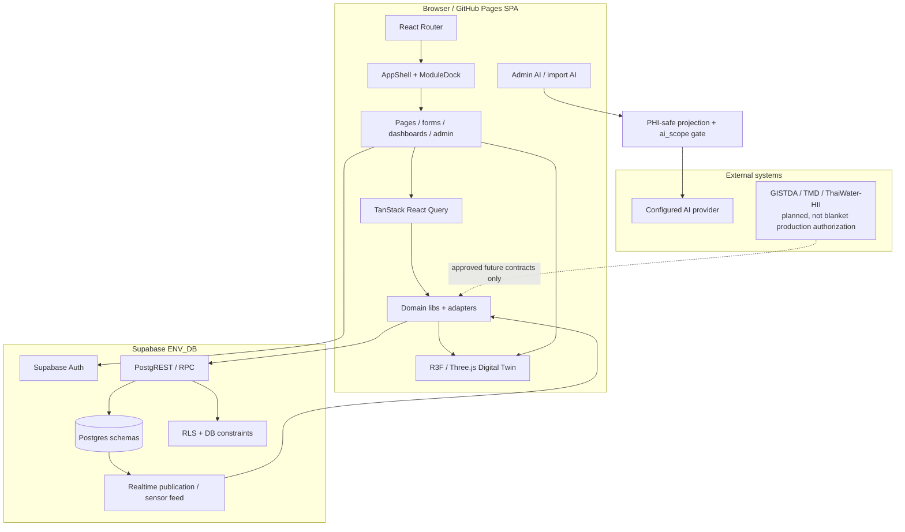

# UTH[AI]-ENV — System Architecture

Last updated: 2026-08-27
Status: ARCHITECTURE SOURCE MAP

## Scope

This document summarizes current implemented architecture and points to deeper sources. It is not permission to redesign working systems.

## 1. Runtime topology

## 2. Frontend structure

### Shell / navigation

Source: `frontend/src/App.tsx`, `frontend/src/components/layout/AppShell.tsx`, `ModuleDock.tsx`.

The application has one authenticated app shell with role-gated routes. Current navigation includes wastewater operations, carbon, sensor/equipment/reporting, multi-domain ENV modules, attachments, and admin tools.

Important rule: long-term IA may evolve, but existing routes remain until a bounded work order explicitly changes them.

### Operational recording

Highest-density current recording flow is `DailyFormPage.tsx`:

- daily wastewater reading create/edit;
- water-quality fields;
- chlorine/sludge fields;
- 10 equipment checks;
- water/electricity values;
- discharge state;
- color/smell/notes;
- threshold feedback;
- abnormal-system cause to repair-request path;
- edit hydration protection against background refetch overwriting dirty input.

Several ENV module pages also contain data-entry controls (`ChemicalPage`, `WaterSupplyPage`, `FuelPage`, `GardenPage`, `GarbagePage`, `FoodPage`, `SafetyPage`, `BuildingPage`). These are separate domain contracts and must not be homogenized by a visual rewrite without source/data review.

### Dashboard / intelligence

Current implemented surfaces include:

- `OverviewPage.tsx` — unified summary;
- `DashboardPage.tsx` — wastewater dashboard and 3D/Process experience;
- `TrendsPage.tsx`, `CarbonPage.tsx`, `CarbonRollupPage.tsx`;
- reusable Situation & Trend components under `components/analytics/`;
- wastewater flow/PFD components;
- Digital Twin components under `components/digital-twin/`.

The prototype north star is additive. It does not invalidate these foundations.

## 3. Data access architecture

### Client boundary

`frontend/src/lib/supabase.ts` creates one browser Supabase client using the publishable/anon key. The service-role key must never be shipped to the browser.

### Query/state layers

- TanStack React Query is the source for server/query cache state.
- Domain modules under `frontend/src/lib/` wrap Supabase access and application semantics.
- Zustand is limited to Twin interaction/simulation state; it is not the telemetry source of truth.
- Manual latest snapshots and future realtime sensor telemetry remain separate semantic modes.

### Database schemas visible in current live schema snapshot

Source: `reports/schema-snapshot-live.md`.

Implemented domain families include:

- `wastewater.*` — readings, sensors, sensor readings, thresholds, alerts, views;
- `carbon.*` — meters/readings/emission factors/rollups;
- `core.*` — users, personnel, locations, equipment, repair requests, attachments, regulations, audit, AI provider/scope/log, module visibility, PDF templates;
- `water_supply.*`;
- `garbage.*`;
- `fuel.*`;
- `garden.*`;
- `building.*`;
- `safety.*`;
- `food.*`;
- `chemical.*`.

Schema reality overrides stale design docs. Refresh/introspect according to existing repository tooling before schema-sensitive work.

## 4. Security / privacy architecture

### Authentication / authorization

- Supabase Auth provides browser sessions.
- Routes use `RequireAuth` and admin restrictions.
- Database access is additionally controlled by RLS and DB constraints.
- Pending-user denial is implemented at the RLS layer, not only UI navigation.

### PHI / external AI boundary

External AI calls are higher-risk than normal database rendering.

Binding contract:

- positive provider-visible fields must be schema-backed and explicitly safe;
- runtime `core.ai_scope` authorization intersects the static safe profile;
- unrestricted free text must not become provider-visible merely because regex scrubbing exists;
- scope/ambiguity failures fail closed;
- projection happens before prompt/provider payload construction;
- refusal paths must not echo raw rows.

Source: `frontend/src/lib/admin/annotate-boundary.ts`, tests, `DEFECT-MEMORY.md`.

### Secrets

- `.env` and raw operational exports are never committed or printed.
- public Supabase keys are RLS-gated; private provider/service credentials remain governed by repository security rules.

## 5. Digital Twin architecture

Source: `frontend/src/components/digital-twin/`, `frontend/src/lib/twin/`, and `docs/ai/digital-twin/`.

Contracts already merged and not to regress:

- Digital Twin is optional/fallback-safe;
- Process/Data paths remain accessible outside Canvas;
- manual current snapshot = `latest`, not `live`;
- `live` is reserved for actual sensor telemetry;
- unknown telemetry stays unknown;
- plant-wide derived values are not relabeled as direct equipment measurements;
- simulation is explicit;
- renderer failure/context loss has recovery/fallback behavior;
- reduced motion is respected.

Wastewater physical topology decisions must also read `docs/ai/digital-twin/11-UTHAI-ACTIVATED-SLUDGE-PROCESS-KNOWLEDGE.md`.

## 6. External environmental intelligence

Planning exists for PM2.5, heat, river/flood and geospatial context under `docs/ai/environmental-intelligence/`.

Any production integration must preserve at least:

- provider/source;
- observation/source type;
- observed/valid time;
- ingestion time;
- freshness/staleness;
- unit;
- geometry/location when relevant;
- derivation/provenance.

Forecast, satellite estimate, model output, sensor measurement and manual observation are distinct.

## 7. Build, test and release

Frontend scripts in `frontend/package.json`:

- `npm run build` — TypeScript build + Vite build;
- `npm run lint` — oxlint;
- `npm test` — Vitest;
- `npm run e2e` — Playwright;
- `npm run e2e:prod` — production URL E2E profile.

GitHub Actions:

- `test.yml` — script regression gate;
- `e2e.yml` — frontend PR exact-code Playwright webServer profile plus build;
- `deploy-frontend.yml` — main-path GitHub Pages build/deploy plus production smoke;
- keepalive workflow for Supabase.

Do not call a check valid unless its path filters and tested SHA actually apply to the change.

## 8. Architecture boundaries to protect

1. No return to retired FastAPI production path without a new ADR and explicit authorization.
2. No broad route/navigation rewrite merely to match prototype imagery.
3. No 3D-only safety-critical information.
4. No external AI/provider data exfiltration outside approved safe boundary.
5. No frontend assumptions that bypass RLS as the security gate.
6. No fake realtime semantics.
7. No missing-value coercion into safe/normal/zero.
8. No parallel writer collision on shared page shells, tokens, route files, or data contracts.

## 9. Current architectural gaps

These are planning findings, not automatic implementation permission:

- product architecture is now unified here, but production screens still reflect multiple historical waves and need incremental convergence toward the north star;
- `DailyFormPage` is the densest operational flow and currently uses multiple unconditional two-column grids at phone widths, which conflicts with the user-confirmed mobile-first form goal;
- reusable analytics kit exists but is not yet the common presentation language across all command-center surfaces;
- Flow, Operations, Hazard Map, Resource Explorer and System/Data Network are not all production surfaces yet;
- external hazard source contracts remain planned/deferred until activated;
- long-term IA remains intentionally incremental rather than a one-shot rewrite.

See `docs/ai/ROADMAP.md` for the bounded sequence that addresses these gaps.
