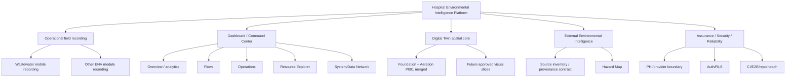
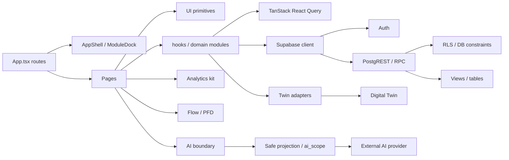
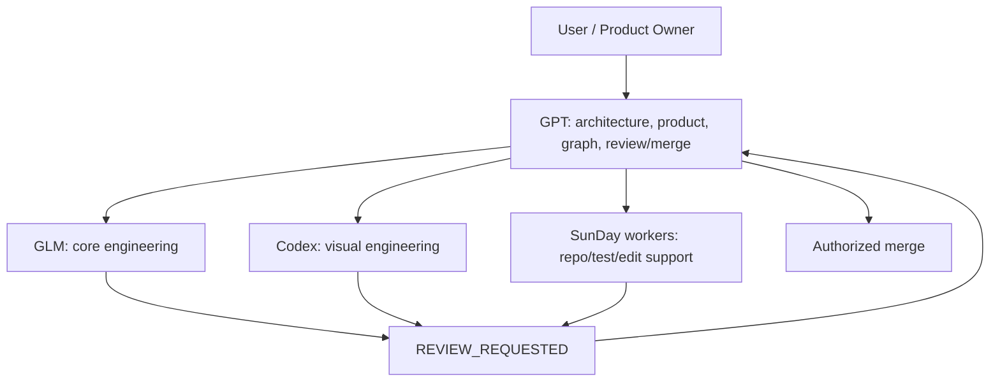
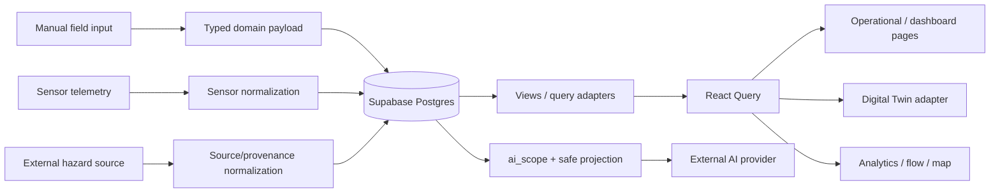
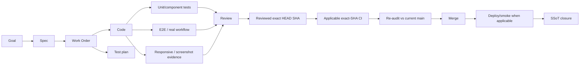

# UTH[AI]-ENV — Project Graph

Last updated: 2026-08-28
Status: GRAPH ENGINEERING SSoT

## Purpose

This file provides one graph-oriented view of goals, dependencies, ownership, risk, evidence, and data lineage. It is intentionally compact: use it to detect collisions and critical paths, then follow links to deeper source documents.

## 1. Goal → work graph

Current critical path for product development:

`current-state inventory → responsive/mobile contract → wastewater mobile data-entry slice → shared command-center composition → bounded dashboard intelligence slices → external source/provenance contract → hazard integration`

The Digital Twin board can proceed in parallel only where file ownership and semantic dependencies remain isolated.

## 2. Runtime dependency graph

High-blast-radius nodes:

| Node | Why high blast radius | Ownership rule |
|---|---|---|
| `frontend/src/App.tsx` | all routing / auth shell | temporary explicit writer only |
| `components/layout/AppShell.tsx` / `ModuleDock.tsx` | navigation and all-route responsive shell | Visual owner + GPT contract review |
| shared `components/ui/**` / styles | affects many pages | no parallel blind edits |
| `lib/supabase.ts` / shared query client | all data access/session behavior | Core Engineering |
| DB RLS/migrations | security/data for many modules | Core Engineering + independent review |
| `DashboardPage.tsx` | Digital Twin + process + dashboard composition | explicit temporary ownership |
| AI provider boundary | external data-exfiltration risk | Core Engineering + security review |
| `CURRENT-WORK.md` / `HANDOFF.md` | project execution authority | coordinator/reviewer ownership during parallel lanes |

## 3. Ownership graph

Responsibility by correctness domain:

- architecture / product semantics / IA / final decision: GPT;
- DB/query/security/data contracts/business rules: GLM/Core Engineering;
- visual hierarchy/responsive/interaction/3D: Codex/Visual Engineering;
- independent repository verification may use a separate worker/agent;
- one writer per authoritative file at a time.

## 4. Data lineage graph

Critical semantic separations:

- manual `latest` ≠ sensor `live`;
- forecast ≠ observation;
- satellite estimate ≠ ground measurement;
- simulation ≠ observed reality;
- derived plant-wide metric ≠ direct asset measurement;
- missing ≠ zero/normal/safe.

## 5. Evidence graph

No `APPROVED` claim is complete for a code-changing slice unless the evidence matches the reviewed SHA and applicable workflow.

## 6. Risk graph

| Risk node | Downstream impact | Required guard |
|---|---|---|
| stale/dirty worktree treated as truth | invalid plans/diffs/merge | fetch + isolated worktree when needed |
| free text crosses external AI boundary | PHI/privacy incident | schema-backed positive projection, fail closed |
| stale metric allowlist | future PHI/data leak | exact schema-backed contract tests |
| manual snapshot called `live` | false operational claim | mode contract tests |
| plant average shown as tank sensor value | false engineering meaning | semantic adapter tests |
| mobile desktop-grid squeeze | field-entry errors / poor completion | phone-width responsive contract + E2E |
| shared file edited by parallel agents | merge conflict / hidden regressions | explicit temporary ownership |
| PR E2E tests deployed main instead of PR | false green CI | branch webServer exact-code E2E |
| optimistic repeated action not idempotent | count/state drift | repeat-action regression tests |
| external source without provenance/freshness | unsafe decision context | normalized source contract before UI |

Reusable verified lessons are maintained in `docs/ai/DEFECT-MEMORY.md`.

## 7. Parallel-safe lanes

Parallel work is allowed only after checking this graph and file ownership.

Examples generally safe when files/contracts do not overlap:

- Digital Twin visual-local implementation vs isolated analytics component work;
- source/provenance research docs vs mobile-form implementation;
- read-only graph/review analysis vs one active implementation writer.

Examples not safe without coordination:

- two lanes editing `App.tsx`, AppShell, shared styles/tokens, `DashboardPage.tsx`, shared DB contracts, or shared SSoT state files;
- visual lane inventing data semantics that Core Engineering has not validated;
- Core Engineering changing visual hierarchy while a visual owner is active on the same page.

## 8. Current orphan/stale check

At this checkpoint:

- Foundation/P1 stabilization is closed;
- ENV-ARCH-001 is merged and supplies the current operating architecture/graph/roadmap;
- ENV-MOBILE-001 is reviewed, merged, deployed, production-smoked, and closed; its remediation/test lanes are read-only historical evidence;
- no active writer owns the completed DailyForm slice;
- deferred design/external lanes remain recorded, not lost;
- `ENV-MOBILE-002` Chemical is the active critical-path slice with an explicit work order/claim and page/test ownership;
- its current gate is deterministic phone-width RED/baseline evidence before any production mutation;
- `frontend/src/lib/chemical.ts`, schema/RLS, shared UI/AppShell, other module forms, and Digital Twin remain outside its mutable scope;
- Water Supply and later domain-form slices must not be started in parallel while Chemical is active.

Current critical-path handoff:

`ENV-MOBILE-001 COMPLETE → ENV-MOBILE-002 Chemical DESIGNING/BASELINE_REQUIRED → bounded implementation → independent review → CI → merge/deploy/closure`
